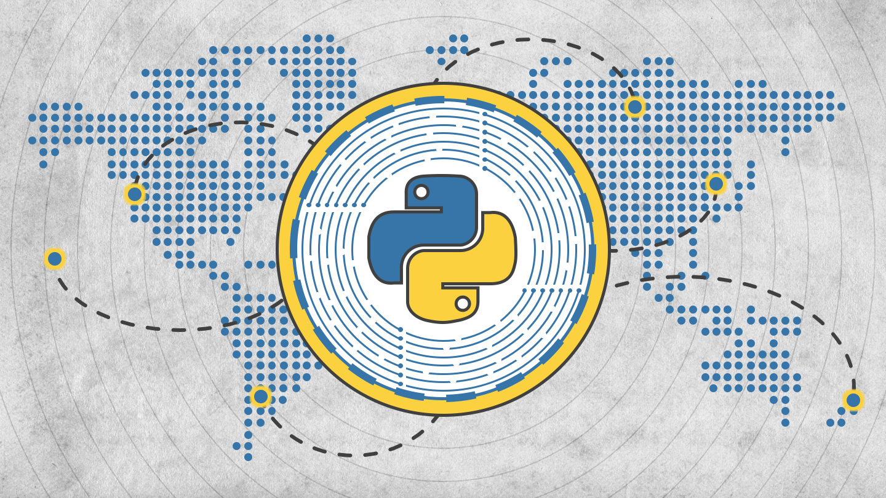

## Python, JS, & React | Build a Blockchain & Cryptocurrency



**The course is designed to help you achieve three main goals:**
- Learn Python and Backend Web Development.
- Build a Blockchain and Cryptocurrency Project that you can add to your portfolio.
- Learn JavaScript, Frontend Web Development, React.js, and React Hooks.

The course's main project is to build a blockchain and cryptocurrency. With a blockchain and cryptocurrency system as the main goal, you will go through a course journey that starts with backend development using Python. Then, you will transaction to frontend web development with JavaScript, React.js, and React Hooks.

Check out the course: https://www.udemy.com/course/python-js-react-blockchain/?referralCode=9051A01550E782315B77

**Here's an overview of the overall course journey:**
- Get an introduction of the Python Fundamentals.
- Begin building the Blockchain Application with Python.
- Test the Application using Pytest.
- Incorporate the crucial concept of Proof of Work into the Blockchain.
- Enhance the application to prepare for networking.
- Create the Blockchain network using Flask and Pub/Sub.
- Integrate the Cryptocurrency, building Wallets, Keys, and Transactions.
- Extend the network implementation with the cryptocurrency.
- Transition from Python to JavaScript with a "From Python to JavaScript" introduction.
- Establish frontend web development skills and begin coding with React.js.
- Create the frontend portion for the blockchain portion of the system.
- Complete the frontend by building a UI for the cryptocurrency portion of the system.

**In addition, here are the skills that you'll gain from the course:**
- How to build a blockchain and cryptocurrency system from scratch.
- The fundamentals of python - data structures, object-oriented programming, modules, and more.
- The ins and outs of hashing and sha256.
- Encoding and decoding in utf-8.
- Testing Python applications with pytest.
- Python virtual environments.
- The concept of proof of work, and how it pertains to mining blocks.
- Conversion between hexadecimal to binary.
- HTTP APIs and requests.
- How to create APIs with Python Flask.
- The publish/subscribe pattern to set up networks.
- When to apply the concepts of serialization and deserialization.
- Public/private keypairs and generating data signatures.
- The fundamentals of JavaScript.
- Frontend web development and how web applications are constructed.
- The core concepts of React and React hooks.
- How the React engine works under the hood, and how React applies hooks.
- CORS - and how to get over the CORS error properly.
- How to build a pagination system.

***

#### Command Reference

**Activate the virtual environment**
```
source blockchain-env/bin/activate
```

**Install all packages**
```
pip3 install -r requirements.txt
```

**Run the tests**

Make sure to activate the virtual environment.

```
python3 -m pytest backend/tests
```

**Run the application and API**

Make sure to activate the virtual environment.

```
python3 -m backend.app
```

**Run a peer instance**

Make sure to activate the virtual environment.

```
export PEER=True && python3 -m backend.app
```

**Run the frontend**

In the frontend directory:
```
npm run start
```

**Seed the backend with data**

Make sure to activate the virtual environment.

```
export SEED_DATA=True && python3 -m backend.app
```